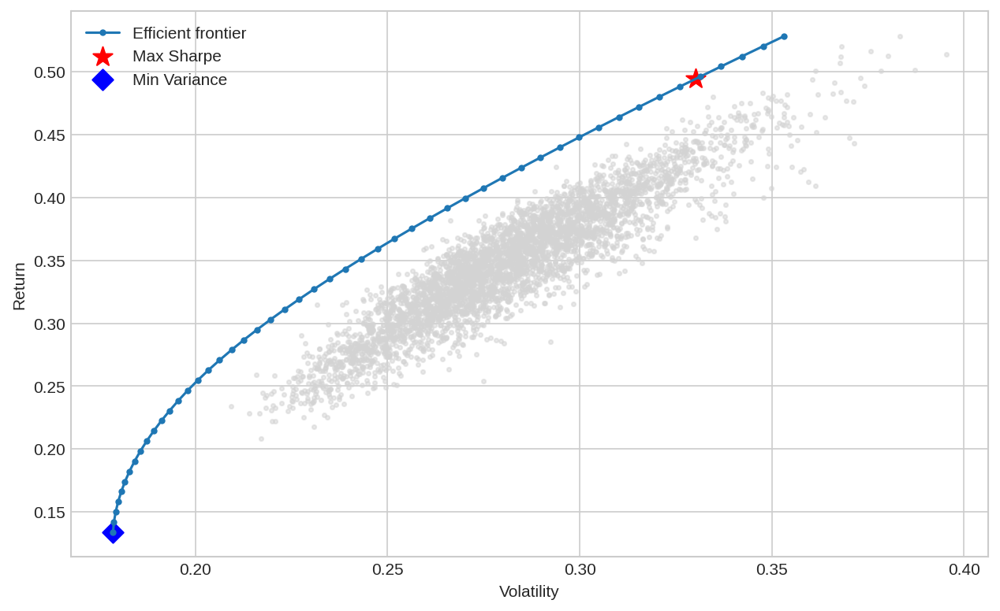
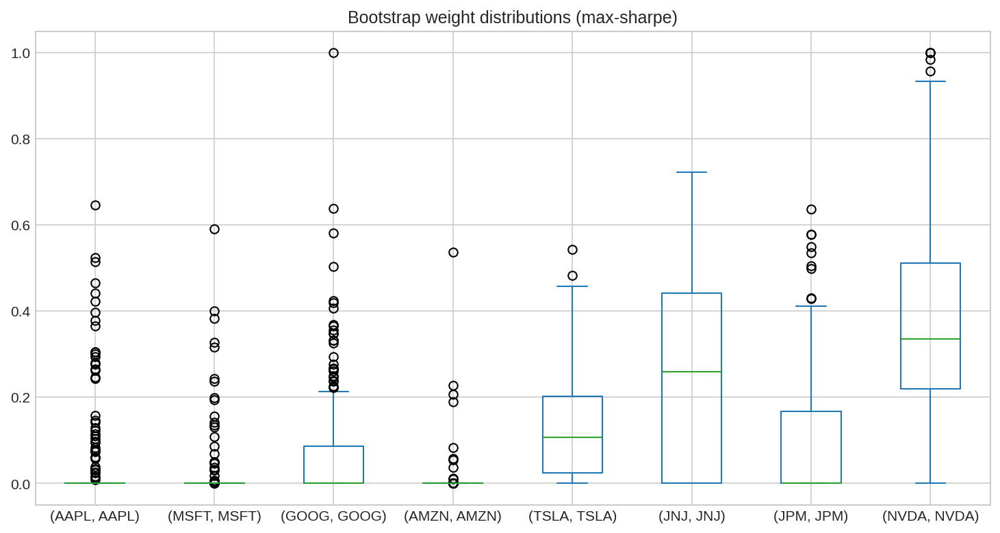

# **Stage 8 — Markowitz Portfolio Optimization**

This project marks my transition from **intuitive simulations** to **formal optimization** — from watching randomness unfold to *designing* it mathematically.  
It implements **Harry Markowitz’s Modern Portfolio Theory** using real market data, demonstrating how return, volatility, and correlation combine to form the **Efficient Frontier**.

Earlier stages focused on building intuition — automating Python basics from *Automate the Boring Stuff* and learning simulation logic inspired by *Python for Finance*.  
Now, those foundations evolve into full-scale portfolio construction, optimization, and stability testing.

---

## **Core Objectives**

- Construct the **Efficient Frontier** using annualized stock return and covariance data  
- Compute portfolios for:  
  - **Maximum Sharpe ratio** (highest reward per unit risk)  
  - **Minimum variance** (lowest total risk)  
- Apply **SLSQP optimization** to solve for optimal weights under constraints  
- Use **Ledoit–Wolf shrinkage** to regularize noisy covariance estimates  
- Run **bootstrap resampling** to test portfolio stability across randomized market conditions  
- Visualize and interpret **risk–return clouds**, **frontiers**, and **weight distributions**

---

## **Technical Breakdown**

- **Data Source:** `yfinance` (AAPL, MSFT, GOOG, AMZN, TSLA, JNJ, JPM, NVDA)  
- **Libraries:** `NumPy`, `Pandas`, `Matplotlib`, `SciPy`, `sklearn.covariance`  
- **Optimization:** SLSQP (Sequential Least Squares Programming)  
- **Covariance Regularization:** Ledoit–Wolf Shrinkage  
- **Diagnostics:** Bootstrap Resampling (200 iterations)  

---

## **Results**

| Portfolio Type | Sharpe Ratio | Growth (× Initial Value) |
|----------------|--------------|---------------------------|
| Equal-Weighted | — | 8.39× |
| Max-Sharpe (Raw Covariance) | 1.440 | — |
| Max-Sharpe (Ledoit–Wolf Shrunk) | 1.444 | 21.20× |

The **shrunk covariance matrix** slightly improves stability and Sharpe ratio, avoiding over-fitting to historical data.

---

## **Interpretation**

The optimized (shrunk) portfolio allocates higher weights to assets offering the best balance between **expected return and correlation**, such as NVDA and JNJ.  
It achieves **over 2.5× the growth** of an equal-weighted portfolio across the same 2020–2025 horizon, showing the impact of diversification and mathematical optimization.

## 📊 Visual Results

### Efficient Frontier
Shows the trade-off between risk and expected return for different portfolio combinations.

### Bootstrap Weights Distribution
Displays weight stability across bootstrap resamples, highlighting robust allocation patterns.

### Cumulative Return Comparison
Compares the growth of an equal-weighted portfolio vs. the optimized portfolio.

---

## **Why This Stage Matters**

This stage blends all prior learning — Python logic, simulation, and financial intuition — into the **first rigorous quantitative framework**.  
It’s where code becomes *decision*, and randomness becomes *structure*.  
The next steps will build on this to explore **backtesting, live portfolio rebalancing, and strategy research**.
