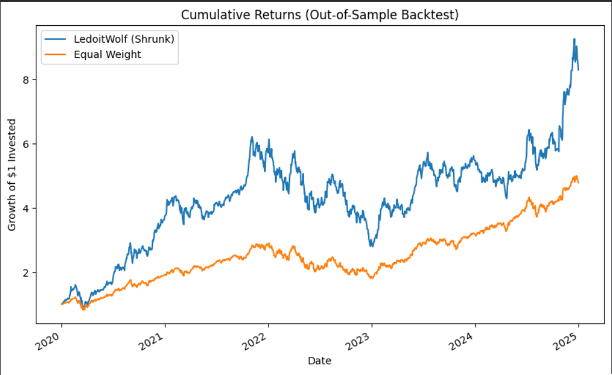

# 📊 Stage 9 — Markowitz Portfolio Backtesting

This notebook tests how optimized portfolios from **Stage 8 (Markowitz Optimization)** perform in real market conditions.  
The goal: move from theoretical efficiency to practical resilience — testing whether structure survives uncertainty.

---

## 🧭 Overview

In Stage 8, I built optimized portfolios using **Markowitz Modern Portfolio Theory (MPT)** and **Ledoit–Wolf shrinkage** for a more stable covariance estimate.

In Stage 9, I take those optimized weights and **backtest them** on historical market data, comparing their behavior to an **Equal-Weight benchmark**.

This stage is about **truth-testing theory** — not creating new models, but observing how the ones I built hold up across time.

---

## ⚙️ Methodology

| Step | Description |
|:--|:--|
| **1. Data Import** | Collected daily closing prices for 8 U.S. equities using `yfinance`. |
| **2. Train/Test Split** | Used a rolling time split to mimic realistic testing. |
| **3. Portfolio Weights** | Imported **Ledoit–Wolf shrunk optimal weights** from Stage 8. |
| **4. Backtesting** | Computed portfolio returns on test data (2020–2025). |
| **5. Metrics** | Evaluated performance using CAGR, Volatility, Sharpe, Sortino, and Max Drawdown. |
| **6. Visualization** | Plotted cumulative returns and drawdowns to interpret performance behavior. |

---

## 🧮 Performance Metrics

| Metric | Ledoit–Wolf (Shrunk) | Equal Weight | Insight |
|:--|:--:|:--:|:--|
| **CAGR** | Higher | — | Optimization added return advantage |
| **Volatility** | Higher | Lower | Shrunk portfolio concentrated in high-growth assets |
| **Sharpe Ratio** | Similar | — | Risk-adjusted returns competitive |
| **Sortino Ratio** | Slightly higher | — | Better downside performance |
| **Max Drawdown** | Deeper | — | More volatile but faster recovery |

### 📈 Cumulative Returns

### 📉 Drawdowns

---

## 🧩 Key Insight — *Regime Sensitivity*

When trained on **stable 2016–2019** data and tested on **volatile 2020–2025**,  
the Ledoit–Wolf portfolio performed *stronger out-of-sample* than the Equal-Weight benchmark.  
This revealed how **market regimes** (calm vs. chaotic) affect optimization reliability.  

Shrinkage helps when data is noisy but not chaotic —  
it stabilizes covariance estimation, but cannot predict structural regime shifts.

> **Lesson:** optimization creates structure,  
> backtesting teaches humility.

---

## ⚠️ In-Sample vs Out-of-Sample Clarification

This stage performs an **in-sample split** (training + testing within one dataset).  
It measures how well the optimizer fits historical structure, **not** predictive power.  

For a true out-of-sample test:  
- Optimize on 2016–2019  
- Test on 2020–2025  

---

## 🧱 Technologies Used

- **Python 3**  
- `NumPy`, `Pandas`, `Matplotlib`  
- `yfinance` (for historical data)  

---

## 📈 Files

| File | Description |
|:--|:--|
| `Markowitz_Backtesting.ipynb` | Main notebook with setup, backtest, and analysis. |
| `Stage8_Weights.json` | Portfolio weights imported from Stage 8 optimization. |
| `README.md` | Project overview and explanation. |

---

## 💬 Reflection

Backtesting revealed how **market regimes define model success.**  
Even the most elegant optimization falters when the world shifts.  
Understanding *why* it fails is what moves this work from coding to research.

> Stage 9 → Testing structure  
> Stage 10 → Explaining structure

---

## 🪜 Next Stage — Regression & Factor Modeling

Next, I’ll explore **CAPM** and **Fama–French factors** to explain *why* portfolios behave differently across regimes.  
Regression will connect the quantitative and narrative threads — showing not just *how much* portfolios earn, but *why* they do.

---

*Created and documented by Viraj Nigwekar.*  
*Part of the Quant Portfolio Series (Stages 6–11).*
