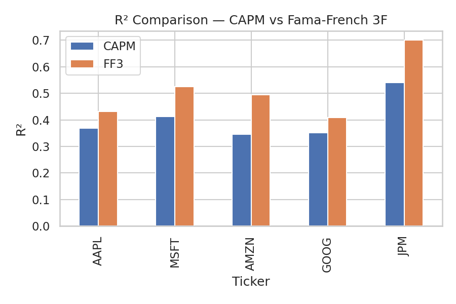

# 📈 Regression & Factor Modelling

This stage combines **Stage 10A (Regression Practice)** and **Stage 10B (Factor Modelling & CAPM)** —  
bridging the gap between simple regression and real-world asset pricing models.  
It’s where returns, risk, and style start forming patterns instead of noise.

---

## 🧩 Overview

After portfolio optimization and backtesting,  
this stage explored **why** assets behave the way they do.  

Starting with **CAPM (Capital Asset Pricing Model)** — single-factor, market-driven.  
Then expanding into the **Fama–French 3-Factor Model** — adding **Size (SMB)** and **Value (HML)**.  
It was the first time I saw randomness organize itself into something that made sense.

---

## 🎨 Visual Highlights

> Visuals generated using `matplotlib` and `seaborn`, all saved under the [`visuals/`](./visuals) folder.

### CAPM Fits  
Stock excess returns vs market excess return — regression line shows β (market sensitivity).

---

### FF3 Residuals  
Residuals over time for the 3-Factor model.  
Random noise = good model. Patterns = missing factor.

---

### R² Comparison  
How much explanatory power improves when moving from CAPM → Fama–French.

---

### Factor Correlation Heatmap  
Checking independence between Mkt–RF, SMB, and HML.  
Moderate correlations mean each factor adds unique information.

---

## 🧠 What’s Inside

### **Stage 10A — Regression Practice**
- Built intuition for OLS regression.  
- Estimated α (alpha), β (beta), and interpreted R².  
- Visualized fits, residuals, and learned statistical storytelling.

### **Stage 10B — Factor Modelling & CAPM**
- Implemented CAPM and Fama–French 3-Factor models.  
- Compared single vs multi-factor explanatory power.  
- Analyzed growth/value/size exposures for multiple stocks.  
- Interpreted market behavior as a combination of structured risks.

---

## 📚 Key Insights

- **CAPM** captured market direction, but missed deeper structure.  
- **Fama–French** revealed *style identity* — size, value, growth.  
- **Tech stocks** (AAPL, MSFT, AMZN, GOOG): large-cap growth (negative HML).  
- **JPM:** value-tilted (positive HML, higher R²).  
- **Multi-factor models** explained 10–20% more variance — showing that returns are multi-dimensional.

---

## 💡 Reflection

This stage wasn’t just math — it was language.  
CAPM taught me that *risk has a price*.  
Fama–French taught me that *not all risk is the same.*

Regression became a way of understanding behavior —  
α as the unexplained, β as exposure, R² as clarity.  
Numbers started to feel alive — statistical, but human.

