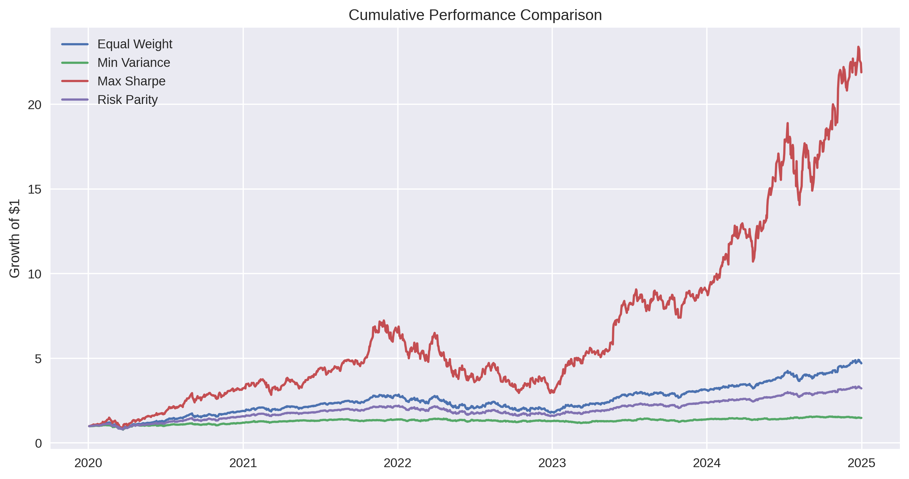
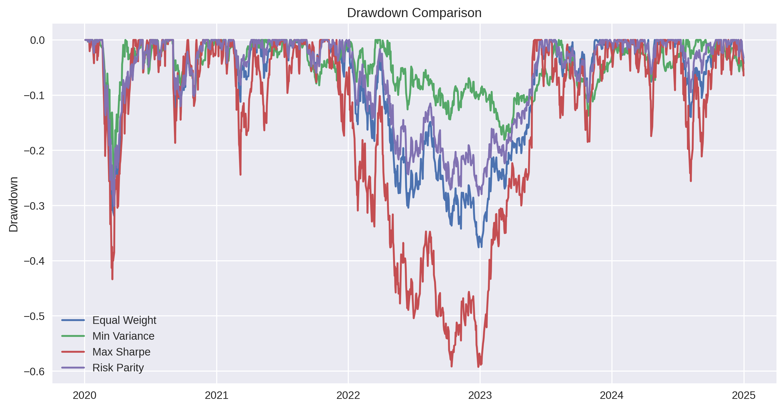
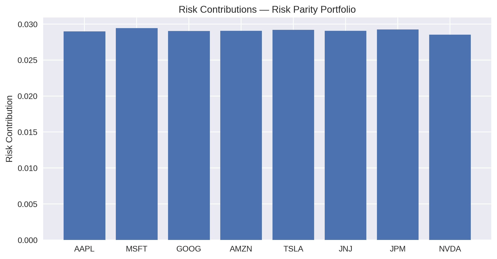

# 📊 Stage 11 — Risk Parity Portfolio Construction

This project implements and analyzes an **Equal Risk Contribution (ERC)** portfolio within a broader portfolio construction framework.

Unlike traditional mean–variance optimization, Risk Parity does not rely on expected return forecasting.  
Instead, it allocates capital such that each asset contributes equally to total portfolio risk.

---

## 🎯 Objective

The goal of this notebook is to:

- Decompose portfolio volatility into individual asset risk contributions  
- Construct a Risk Parity (ERC) portfolio using nonlinear optimization  
- Compare against:
  - Equal Weight
  - Minimum Variance
  - Maximum Sharpe  
- Evaluate performance, volatility, and drawdowns  

---

## ⚙️ Methodology

Let:

- $\Sigma$ = Covariance matrix  
- $w$ = Portfolio weights  

Portfolio variance:

$$
\sigma_p^2 = w^T \Sigma w
$$

Risk contribution of asset $i$:

$$
RC_i = w_i (\Sigma w)_i
$$

Risk Parity condition:

$$
RC_1 = RC_2 = \dots = RC_n
$$

The ERC portfolio is obtained by solving a constrained nonlinear optimization problem enforcing equal risk contributions under long-only constraints.

---

## 📈 Performance Comparison

The portfolios are evaluated using:

- Annualized Return  
- Annualized Volatility  
- Sharpe Ratio  
- Maximum Drawdown  

### Cumulative Performance

(
)

---

### Drawdown Comparison

()

---

### Risk Contributions (ERC Portfolio)

()

---

## 🧠 Key Insights

- Maximum Sharpe achieves the highest return but exhibits extreme drawdowns due to concentration.
- Minimum Variance reduces volatility but sacrifices growth.
- Equal Weight provides a robust baseline.
- Risk Parity reduces concentration risk and improves structural stability by evenly distributing portfolio risk.

This project highlights the structural tradeoff between return maximization and risk stability.

---

## 🛠 Tools Used

- NumPy  
- Pandas  
- SciPy (SLSQP optimization)  
- Matplotlib  
- yFinance  

---

## 📌 Position in Portfolio Series

This notebook follows:

- Monte Carlo simulations  
- Mean–Variance optimization  
- Backtesting  
- Factor modeling  
- Black–Litterman  

Risk Parity introduces a risk-based allocation framework that emphasizes robustness over pure return optimization.

## 📘 What I Learned

This project strengthened both my technical and conceptual understanding of portfolio construction.

### 🔹 Technical Skills Developed

- Implemented volatility decomposition and risk contribution analysis  
- Derived and coded marginal and total risk contributions  
- Solved constrained nonlinear optimization problems using SLSQP  
- Compared allocation frameworks under identical datasets  
- Evaluated portfolios using Sharpe ratio and maximum drawdown  
- Interpreted structural differences between optimization-driven and risk-driven approaches  

### 🔹 Conceptual Progress

Before this project, I viewed portfolio construction primarily through return optimization (e.g., maximizing Sharpe ratio).

Risk Parity shifted that perspective.

Instead of asking:

$$
\text{How can I maximize expected return per unit risk?}
$$

The framework asks:

$$
\text{How is total portfolio risk distributed across assets?}
$$

Through implementation, I observed that:

- Return-maximizing portfolios tend to concentrate capital in a few assets.
- Small changes in covariance can produce extreme weight shifts.
- Equalizing risk contributions creates structurally balanced allocations.
- Stability and robustness often require sacrificing peak performance.

This project deepened my understanding that portfolio engineering is not only about efficiency — it is also about risk structure, robustness, and survivability under stress.

It represents a progression from simulation-based intuition to formal risk budgeting and constrained optimization.
