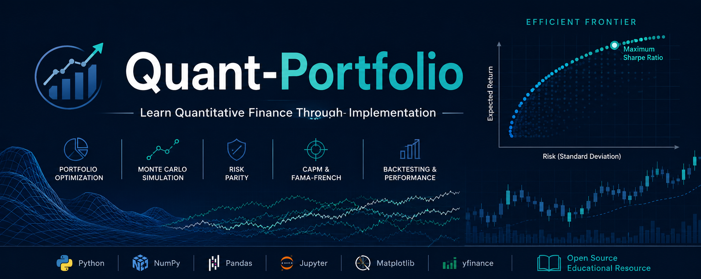

<p align="center">
  
</p>


### Learn Quantitative Finance Through Implementation

A structured, implementation-first journey through **quantitative finance** using Python.

This repository is a collection of educational Jupyter notebooks that progressively introduce the mathematical and computational foundations of modern portfolio management. Rather than presenting isolated algorithms, each notebook builds on previous concepts to develop intuition through simulation, visualization, and empirical analysis using real market data.

Whether you're a student beginning quantitative finance or someone looking to understand portfolio optimization from first principles, this repository aims to bridge the gap between theory and implementation.

---

## Repository Highlights

- 📊 Portfolio Optimization
- 📈 Mean-Variance (Markowitz) Theory
- 🎲 Monte Carlo Simulation
- 📉 Risk & Return Analysis
- 🧠 Black-Litterman Allocation
- ⚖️ Risk Parity
- 📋 Portfolio Backtesting
- 📐 CAPM Regression
- 📚 Fama-French Three-Factor Model
- 🧮 Numerical Computing with NumPy & Pandas
- 📊 Data Visualization

---

# Learning Roadmap

This repository follows a structured progression rather than a collection of unrelated notebooks.

| Stage | Topic |
|--------|-------|
| 1 | Python Foundations |
| 2 | Automation & Scripting |
| 3 | Numerical Computing with NumPy |
| 4 | Financial Data Analysis |
| 5 | Monte Carlo Simulation |
| 6 | Multi-Asset Simulation |
| 7 | Portfolio Statistics |
| 8 | Markowitz Portfolio Optimization |
| 9 | Portfolio Backtesting |
| 10 | CAPM & Fama-French Factor Models |
| 11 | Research & Robust Portfolio Optimization |

Each notebook introduces new mathematical ideas while reinforcing concepts from earlier stages.

---

# Project Gallery

## Efficient Frontier


Visualizing the risk-return trade-off and the efficient frontier under Modern Portfolio Theory.

---

## Portfolio Comparison


Comparing different portfolio construction strategies across risk and expected return.

---

## Risk Parity


Understanding how individual assets contribute to total portfolio risk under a Risk Parity framework.

---

# What You'll Learn

Topics covered throughout the repository include:

- Financial return calculations
- Volatility estimation
- Covariance & correlation
- Diversification
- Monte Carlo simulation
- Geometric Brownian Motion
- Efficient Frontier construction
- Sharpe Ratio optimization
- Ledoit-Wolf covariance shrinkage
- Portfolio backtesting
- Drawdown analysis
- CAPM regression
- Fama-French factor models
- Portfolio performance evaluation

---

# Technologies Used

- Python
- NumPy
- Pandas
- Matplotlib
- Plotly
- SciPy
- Statsmodels
- scikit-learn
- yfinance
- Google Colab

---

# Educational Philosophy

This repository emphasizes **understanding before optimization**.

Instead of treating quantitative finance as a collection of formulas, each notebook focuses on explaining:

- why a model exists,
- the assumptions behind it,
- how it is implemented,
- when it works,
- and where its limitations lie.

The objective is not simply to reproduce results, but to develop mathematical intuition through experimentation and visualization.

---

# Current Research Direction

Alongside these educational notebooks, I am exploring research problems in robust portfolio optimization, with a particular interest in improving portfolio stability under estimation uncertainty.

The notebooks in this repository provide the conceptual foundation for that ongoing work.

---

# Who Is This Repository For?

This project is intended for:

- Students learning quantitative finance
- Undergraduate finance & mathematics students
- Python programmers interested in finance
- Self-learners
- Anyone interested in portfolio optimization and asset pricing

---

# Getting Started

Clone the repository

```bash
git clone https://github.com/Viraj-Nigwekar/Quant-Portfolio.git
```

Install dependencies

```bash
pip install -r requirements.txt
```

Open the notebooks using Jupyter Notebook or Google Colab.

---

# Feedback

Suggestions, corrections, and constructive feedback are always welcome.

If you notice an error, have ideas for improvement, or would like to discuss quantitative finance, feel free to open an Issue or reach out.

📧 **virajnigwekar@gmail.com**

---

# License

Released under the MIT License.
